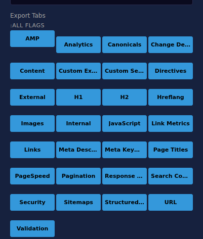
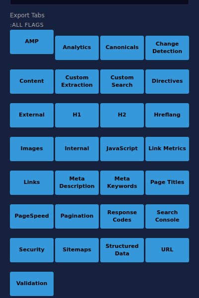
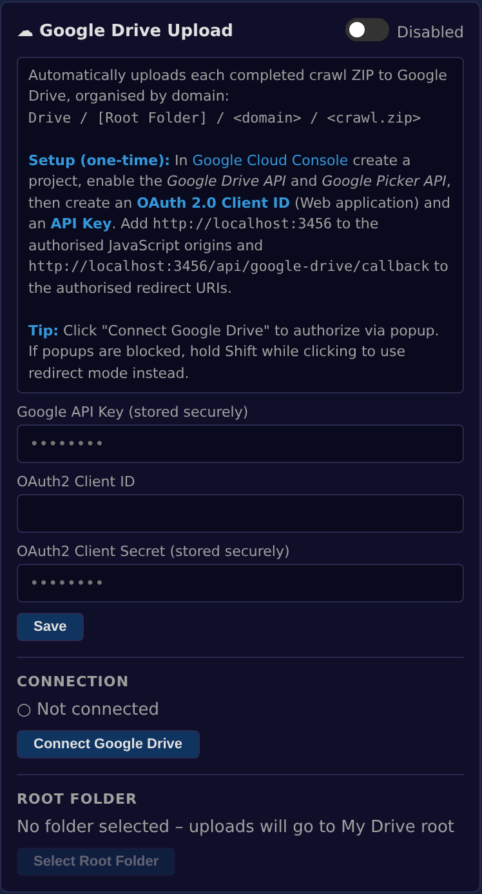
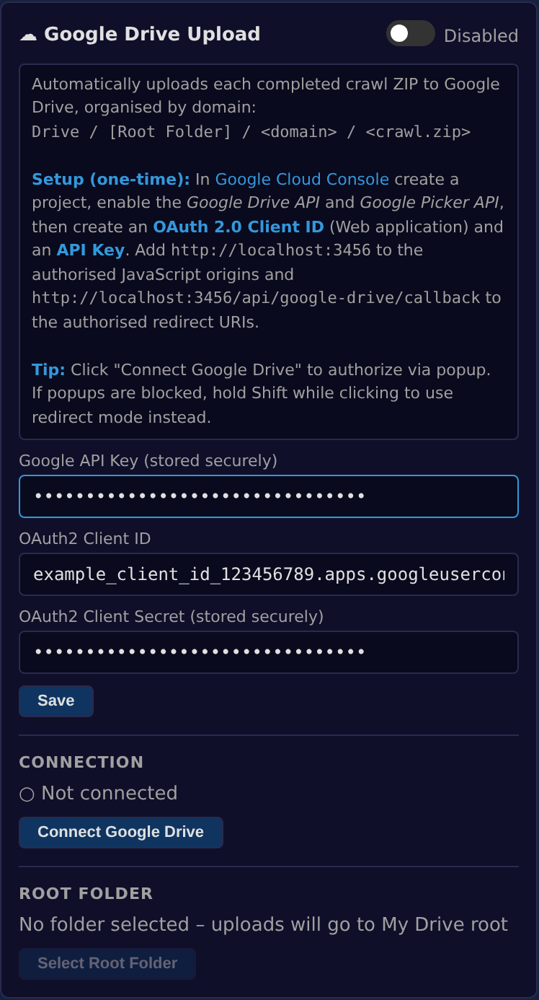
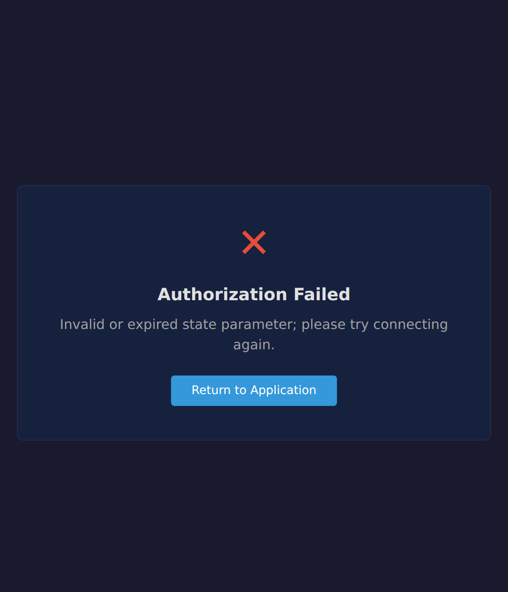

# PR #42 - Google Drive OAuth2 Refactor

**Pull Request:** [#42](https://github.com/jmhthethird/frog_automation/pull/42)

This directory contains before/after screenshots for the Google Drive OAuth2 integration refactor.

---

## Screenshots

### Main Comparison: Before vs After

| Before | After |
|--------|-------|
|  |  |

### Detailed UI Flow

| State | Screenshot |
|-------|------------|
| Initial (Disconnected) |  |
| Credentials Filled |  |
| Saved |  |
| Connected |  |

### OAuth Callback Pages

| Success | Error |
|---------|-------|
|  |  |

### Full API Settings View

---

## Screenshot Specifications

- **Resolution:** 1400x900 pixels (main UI), 600x700 pixels (callback popups)
- **Device Scale Factor:** 2x (high DPI for clarity)
- **Browser:** Chromium (headless mode)
- **Format:** PNG with full color depth

---

**Last Updated:** 2026-03-18
