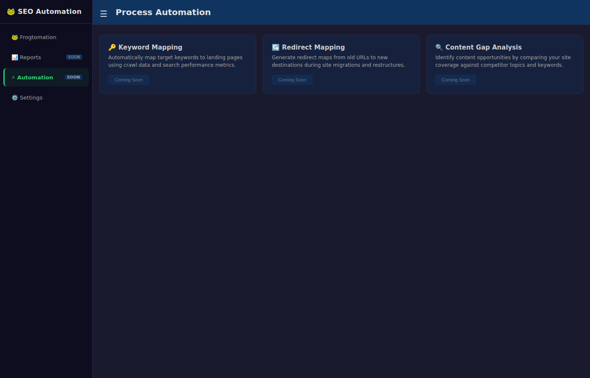
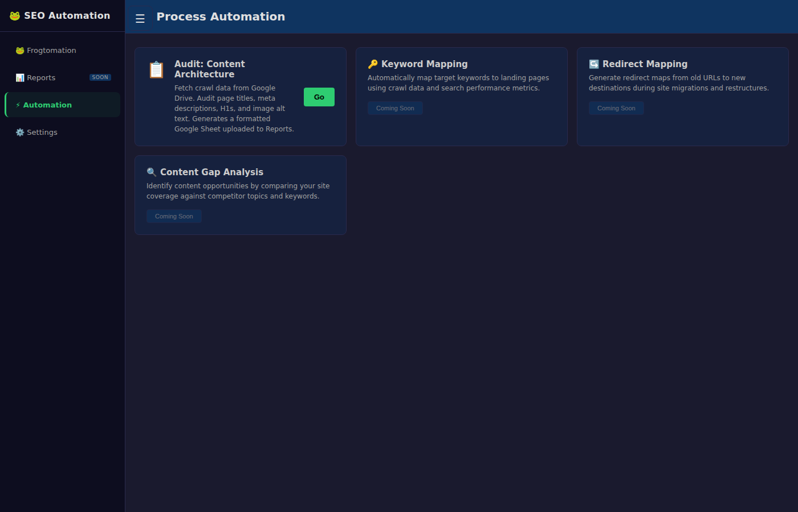
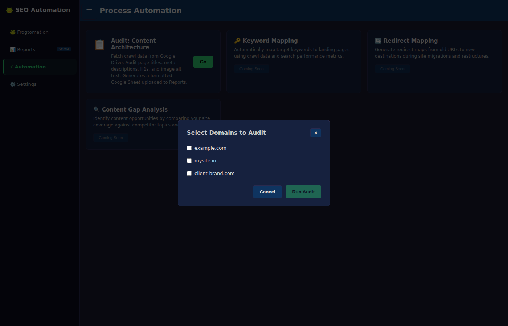

# PR #80 — Content Architecture Audit Automation

**Pull Request:** [#80](https://github.com/jmhthethird/frog_automation/pull/80)

This directory contains before/after screenshots for the Content Architecture Audit automation feature.

---

## Screenshots

### Main Comparison: Before vs After

| Before | After |
|--------|-------|
|  |  |

**Before:** The Automation nav item had a "Soon" badge and the panel contained only four "Coming Soon" placeholder cards. No automation could be run.

**After:** The "Soon" badge is gone. The panel shows the live "Audit: Content Architecture" card with an active "Go" button, alongside three "Coming Soon" placeholders for future automations.

### Domain Selection Modal

| Selecting domains to audit |
|----------------------------|
|  |

Clicking "Go" opens a modal that fetches the list of domains with crawl data from Google Drive (`Crawls/` folder). The user selects one or more domains, then clicks "Run Audit" to start the automation.

---

## What This PR Changes in the UI

1. **Nav item** — Removed the "Soon" badge from the ⚡ Automation nav button
2. **Automation panel** — Replaced all four placeholder cards with:
   - 1 live "Audit: Content Architecture" card with a working "Go" button
   - 3 "Coming Soon" placeholder cards for future automations
3. **Domain selection modal** — Fetches available domains from `/api/automation/domains`; renders checkboxes; enables "Run Audit" when at least one domain is selected
4. **Progress overlay** — Full-screen overlay with spinner, live progress message (polled every 1.5 s from `/api/automation/status`), and a Cancel button
5. **Results display** — On completion, shows per-domain results: issue count summary and a direct link to the generated Google Sheet in Drive; shows error messages for domains that failed

---

## Screenshot Specifications

- **Resolution:** 1400×900 pixels
- **Device Scale Factor:** 1x
- **Browser:** Chromium (headless via Xvfb)
- **Format:** PNG

---

**Last Updated:** 2026-04-01
