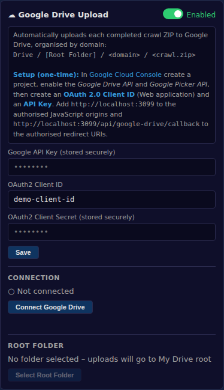
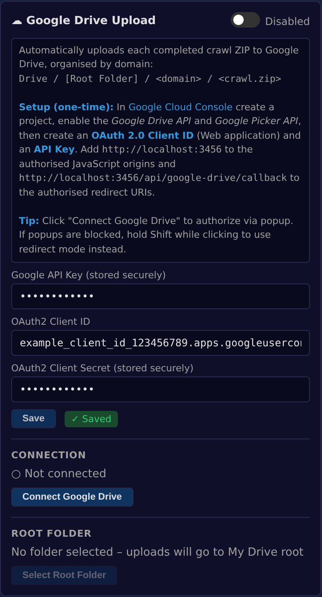
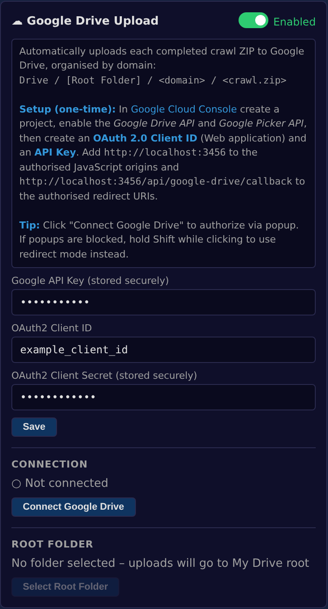
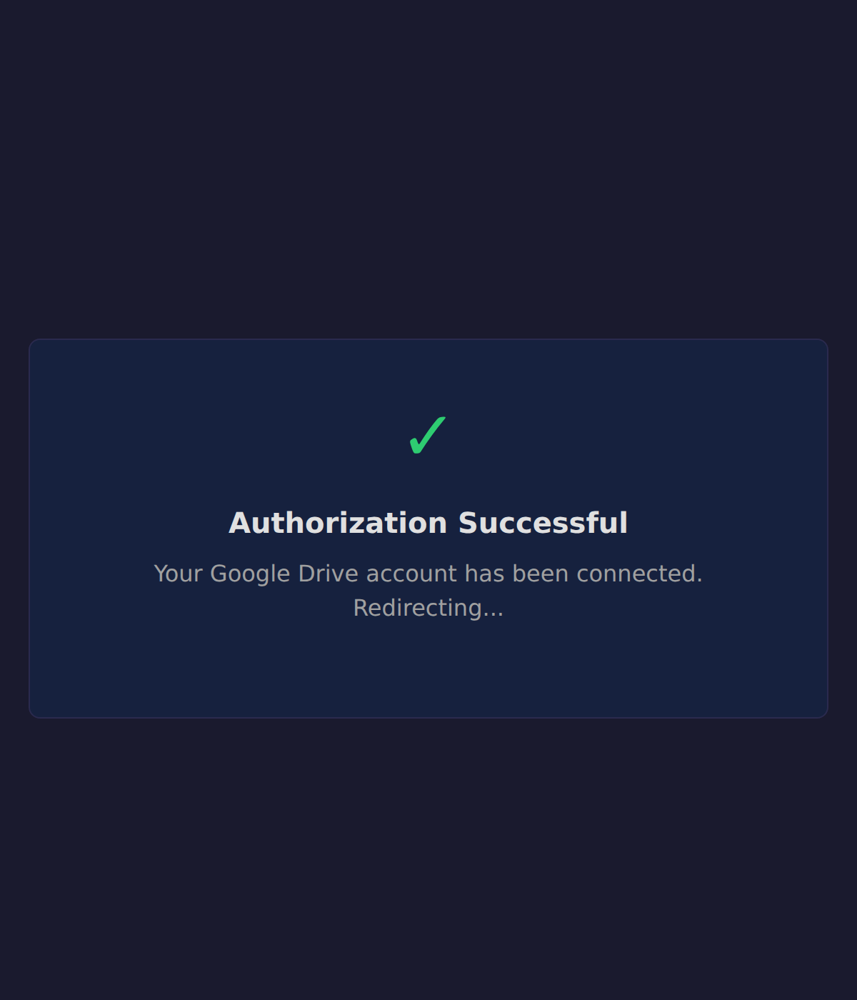
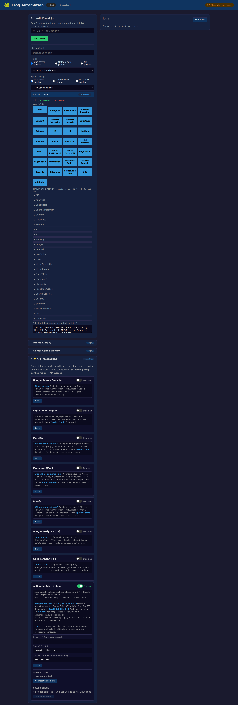

# Google Drive OAuth2 Refactor - UI Screenshots

This directory contains before/after screenshots demonstrating the comprehensive Google Drive OAuth2 integration refactor.

## Overview

The refactor introduces significant improvements to the OAuth flow, user experience, and visual feedback throughout the Google Drive integration.

---

## Main Comparison: Before vs After

### Before (Original Implementation)


**Issues with original implementation:**
- Simple popup with no visual feedback
- No indication of loading/progress states
- Basic error messages without guidance
- No support for popup-blocked scenarios
- Limited user feedback during authorization

### After (Refactored Implementation)


**Improvements in refactored version:**
- Dual-mode OAuth support (popup + redirect)
- Real-time status indicators with color coding
- Professional callback page with loading states
- Popup blocker detection with helpful messages
- Clear visual feedback at every step

---

## Detailed UI Flow Screenshots

### 1. Initial State - Not Connected


**Features shown:**
- Clean, organized credential input fields
- Disabled "Select Root Folder" button (requires connection first)
- Clear "Not connected" status indicator
- Hidden disconnect button (only shown when connected)

### 2. Credentials Entry


**Features shown:**
- OAuth2 Client ID field (text input)
- OAuth2 Client Secret field (password-masked)
- Google API Key field (password-masked)
- Active "Save" button ready for credential storage
- Helpful documentation note with setup instructions

### 3. Credentials Saved


**Features shown:**
- Success message: "✓ Saved"
- Credentials now masked in the UI (showing partial values + bullets)
- "Connect Google Drive" button enabled
- Clear visual feedback on successful save

### 4. Connected State


**Features shown:**
- Green status indicator: "● Connected"
- "Disconnect" button now visible
- "Select Root Folder" button enabled
- Root folder name displayed: "📁 Frog Automation Uploads"
- Toggle enabled showing integration is active

---

## OAuth Callback Pages

### Success Callback


**Features:**
- Large green checkmark (✓) for clear success indication
- Professional dark-themed design matching app
- "Authorization Successful" heading
- Auto-redirect message with countdown
- Consistent styling with application theme

**Technical details:**
- Supports both popup mode (postMessage + close) and redirect mode (sessionStorage + redirect)
- Uses app's design tokens (--bg, --surface, --green)
- Responsive layout that works in popup window or full page

### Error Callback


**Features:**
- Large red X (✕) for clear error indication
- Professional dark-themed design
- "Authorization Failed" heading
- Detailed error message explaining the issue
- "Return to Application" button for easy recovery
- Actionable guidance for next steps

**Technical details:**
- HTML-escaped error messages prevent XSS
- Same styled template for all error types
- Works in both popup and redirect modes

---

## Full API Settings View


**Features shown:**
- Complete API Integrations section expanded
- All API service cards visible
- Google Drive card in context of other integrations
- Toggle switches for enabling/disabling services
- Consistent card layout and styling
- Badge showing number of enabled services

---

## Key UX Improvements Demonstrated

### 1. **Real-Time Status Indicators**
- Color-coded status messages (green/red/blue/gray)
- Status changes as user progresses through flow
- Clear visual feedback at every step

### 2. **Progressive Disclosure**
- Buttons disabled until prerequisites met
- Fields enabled/disabled based on connection state
- Disconnect button only shown when connected

### 3. **Professional Visual Design**
- Consistent dark theme throughout
- Proper use of design tokens (colors, spacing, typography)
- High-quality icons and visual indicators
- Smooth transitions and hover states

### 4. **Error Handling & Guidance**
- Popup blocker detection with helpful error
- Actionable error messages with recovery steps
- Shift+Click hint for redirect mode
- Clear documentation and setup instructions

### 5. **Dual-Mode OAuth Support**
- Default popup mode for seamless experience
- Redirect mode (Shift+Click) when popups blocked
- Automatic detection and graceful fallback
- Works in all environments (browser, Electron, mobile)

---

## Screenshot Specifications

All screenshots were captured using Playwright with the following settings:
- **Resolution:** 1400x900 pixels (main UI), 600x700 pixels (callback popups)
- **Device Scale Factor:** 2x (high DPI for clarity)
- **Browser:** Chromium (headless mode)
- **Format:** PNG with full color depth

---

## How to Regenerate Screenshots

If screenshots need to be updated:

```bash
# 1. Install dependencies
npm install

# 2. Install Playwright browsers
npx playwright install chromium --with-deps

# 3. Start the server
PORT=3456 npm start

# 4. Run screenshot capture script (in another terminal)
node capture-screenshots.js
```

Screenshots will be saved to `docs/screenshots/` directory.

---

## Related Documentation

- **Implementation Guide:** [`docs/google-drive-oauth-implementation.md`](../google-drive-oauth-implementation.md)
- **E2E Tests:** [`tests/e2e/ui.spec.js`](../../tests/e2e/ui.spec.js)
- **Backend Routes:** [`src/routes/google-drive.js`](../../src/routes/google-drive.js)
- **Frontend Code:** [`public/index.html`](../../public/index.html) (search for "Google Drive Integration")

---

**Last Updated:** 2026-03-18
**Version:** 1.0.0
**Author:** Claude Sonnet 4.5
